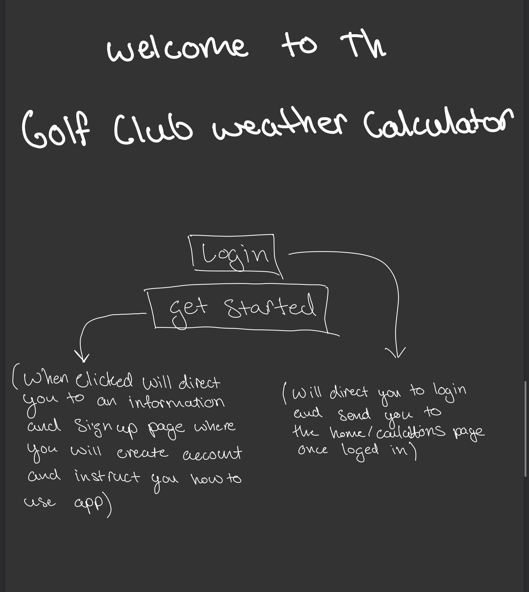
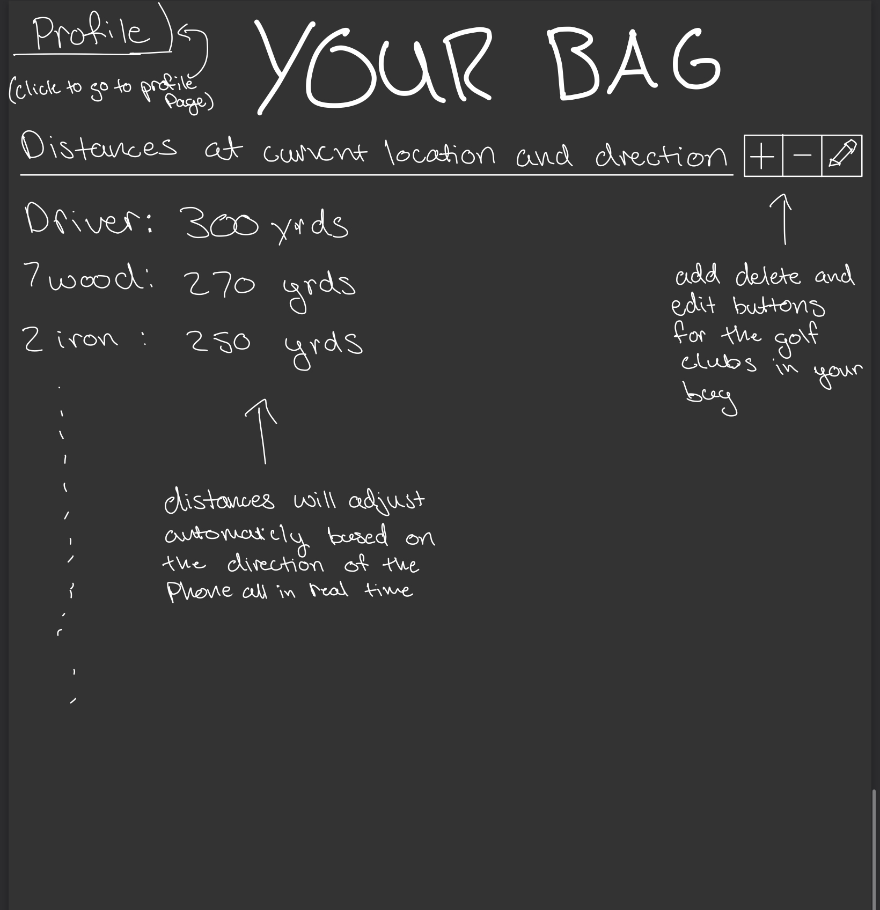
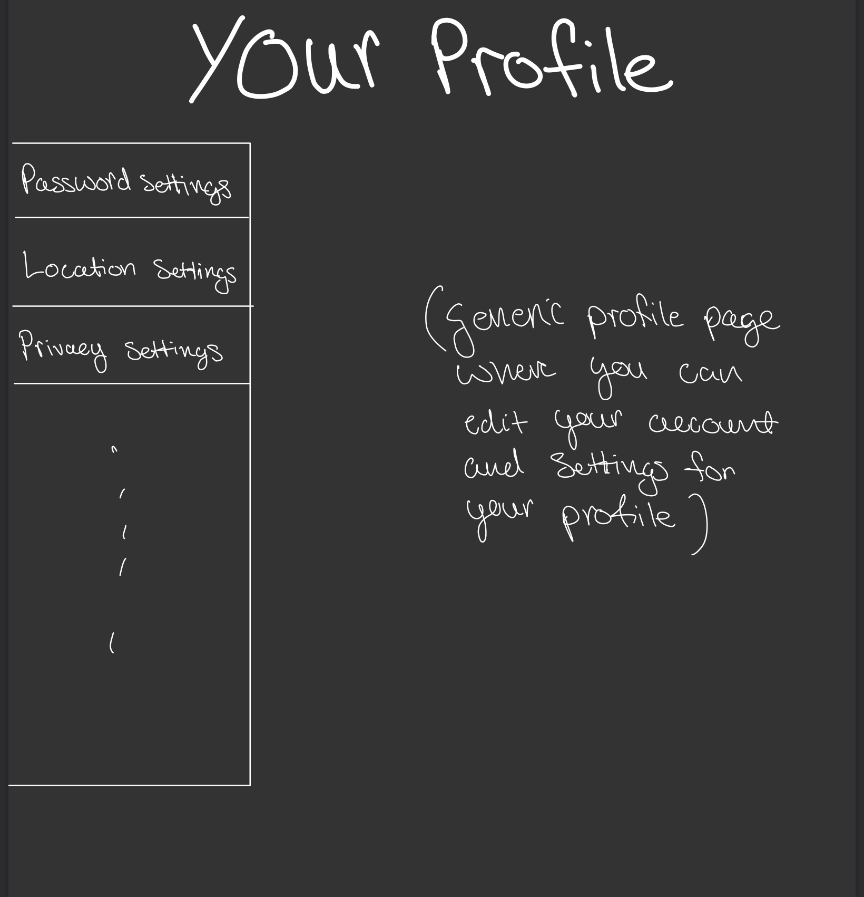

# User Stories:
As a **Golfer**, I want to **View estimated distances of my golf clubs based on the weather in my location** so I can **improve my golf game by having more accurate distances and taking guesswork out of the equation**.

As a **Beta Tester**, I want to **thoroughly use the application for its intended purposes** so I can **ensure that there are no bugs or issues with the application before launch**.
### Acceptance Criteria: 
**Golfer:** this user story will be done when the application is complete and works without any bugs.

**Beta Tester:** this user story will be done when the application is production ready and has no known bugs or issues.

# Mis-user Stories
As a **Hacker**, I want to **infiltrate the account of other users** so I can **learn location wearabouts of that user**.

As a **Malicious-user**, I want to **input false or unrealistic data** so I can **break the calculation algorithm to cause issues with the application such as a crash**.

### Mitigation Criteria:
**Hacker:** I will be done protecting against this mis-user story when there is a secure authentication system implemented and location data is secure.

**Malicious-user:** I will be done protecting against this mis-user story when there is appropriate error handling for unrealistic data such that the calculation algorithm cannot be exploited.

# C4 Diagram
### Context Diagram

### Container Diagram

### Backend Diagram
.jpg)
### Single Page Application Diagram
.jpg)

# Mock Up Diagram
### Login Page

### Home Page

### Profile Page
